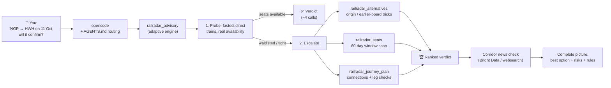
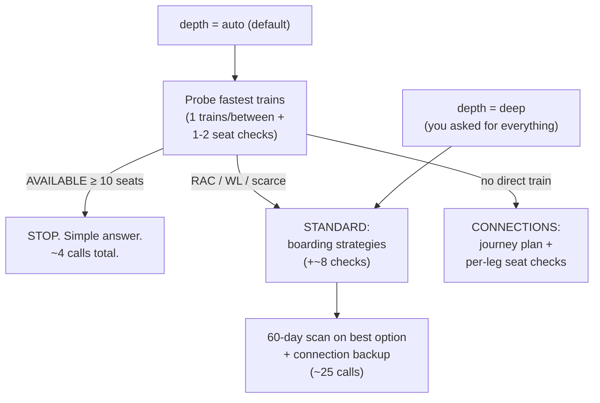

# 🚂 Railu Expert

> *"Will my ticket confirm?"* — finally, an answered question.

Railu Expert turns [opencode](https://opencode.ai) into an **Indian Railways ticket-confirmation advisor**. It doesn't just look up seats — it thinks like a seasoned traveller: trying quota tricks (book from origin, board a halt earlier), scoring confirmation odds from live PRS data, checking connecting routes with transfer risk, and watching the news for fog, floods and blockades that could wreck your trip.

Born from two real trips: **Nizamabad → Ujjain** (where the only sane option was NZB → Nagpur → Ujjain, found by hand) and **Nagpur → Howrah** (where booking from Wardha Jn — one halt earlier — magically produces confirmed seats). This tool automates exactly that kind of thinking.

[](LICENSE)


---

## What it does

| You ask | It answers |
|---|---|
| "Any 3A seats NDLS → BPL next month?" | Date-by-date table across the full 60-day window: AVAILABLE / RAC / GNWL… |
| "NGP → HWH is waitlisted — anything smarter?" | Ranked tricks: book from PUNE (origin quota), board at Wardha (79 km earlier), book to terminus — each **actually checked**, not guessed |
| "NZB → UJN has no direct train" | Connecting itineraries with per-leg availability, transfer risk and connection probability |
| "Is WL 12 worth booking?" | Confirmation-odds verdict using GNWL/RLWL/PQWL priority, RAC math and chart timing |
| "Will fog ruin my December trip?" | Corridor news check (fog, floods, strikes, blocks) before you pay |

And it does all of this **adaptively**: simple questions cost ~4 API calls, full investigations scale up only when seats are actually tight. No overkill.

---

## How it works



### The adaptive depth ladder



You control it: `simple` (peek), `auto` (default — escalates on its own), `standard`, `deep` (the works).

### Where the data comes from

- **RailRadar API** (`api.railradar.in`) — PRS seat calendars, timetables, journey planner. Free tier: **1,000 calls/month**.
- **`indian-rail` MCP** (`indian-rail-mcp`, local) — official NTES/IRCTC feeds: live running status, schedules, station boards, chart vacancy, PNR.
- **Bright Data MCP** (optional) — corridor news search + article scraping with bot-detection bypass. Free tier: **5,000 calls/month**. Falls back to built-in web search when unconfigured.
- **Your brain + IRCTC** — the final booking always happens on [irctc.co.in](https://www.irctc.co.in). This project is **read-only**: it never books, cancels, or holds anything.

### How this got better than what's out there

Before building, the existing tools doing similar work were evaluated — and the gaps found shaped this project:
- **Official sources over scrapes** — live data comes from NTES/IRCTC-direct feeds, not fragile third-party markup parsing that silently returns wrong fields when a site changes layout.
- **Advice, not just data** — confirmation-odds scoring (GNWL/RLWL/PQWL, RAC, chart timing) plus boarding/quota strategies that get actually checked, instead of raw status dumps.
- **Quota-respectful by design** — every run reports its exact API cost, responses are cached, and a degraded mode keeps answering from quota-free sources when the monthly budget runs out.
- **Privacy-first** — everything runs locally on your machine; PNR and chart data never leave it and are never stored.
- **Policy-fenced** — each user brings their own API keys, web scraping is limited to public news, and compliance notes ship with the project.

---

## The toolkit

All RailRadar logic lives in one dependency-free file (`.opencode/tools/railradar.ts` — just `fetch`, no SDKs):

| Tool | Job | Typical cost |
|---|---|---|
| `railradar_advisory` | ⭐ Main entry. Adaptive end-to-end advisor: probes, escalates, verdicts | 4 → ~25 calls |
| `railradar_alternatives` | Boarding/quota strategies per train, ranked by confirmation odds | ~6–12 calls |
| `railradar_seats` | 60-day availability scan, one train/class/quota | 5 calls/full window |
| `railradar_journey_plan` | Multi-stop & connecting itineraries with transfer risk | 1 call |
| `railradar_trains_between` | Timetable lookup between two stations | 1 call |

Plus `indian-rail_*` (live status, PNR, charts) and `brightdata_*` (news) from the MCP servers.

### Confirmation scoring (the rules engine)

Real PRS statuses look like `GNWL40/WL9` or `RAC 61/RAC 35`. The tool parses them and scores:

| Status | Meaning | Verdict |
|---|---|---|
| `AVAILABLE-0084` | 84 seats free | ✅ CONFIRMED |
| `AVAILABLE-0002` | 2 seats free | ✅ CONFIRMED — scarce, book now |
| `RAC 12/RAC 8` | You travel for sure (shared berth), full berth likely | 🟡 Travel likely |
| `GNWL 8` | General waitlist, low number, days to chart | 🟢 GOOD odds (top quota priority) |
| `RLWL 20` / `PQWL 15` | Remote/pooled-quota waitlist | 🟠 MODERATE–LOW (these quotas move slower) |
| `GNWL66/WL38` | Deep waitlist | 🔴 LOW odds |
| Same-day travel | Chart likely prepared (~4–8h before departure) | ⚠️ Only cancellations/VACANCY help now |

Rules baked in: **GNWL > RLWL > PQWL** priority · 60-day ARP window · Tatkal opens 10:00 (AC) / 11:00 (non-AC) a day before · origin/long-route bookings tap the full quota pool · ladies/senior quotas (`LD`/`SS`) are often easier.

---

## Setup

### Prerequisites

- [opencode](https://opencode.ai) (tested on v1.18.x) + any LLM provider configured in it
- Node.js 18+ (for `npx` MCP servers)
- A **RailRadar API key** ([railradar.in](https://railradar.in) → API portal, free 1K calls/month) — required
- A **Bright Data API token** ([brightdata.com](https://brightdata.com) → account settings, free 5K calls/month) — optional, news only

### Install

```powershell
git clone https://github.com/108tsrenukesh/Railu_Expert.git
cd Railu_Expert

# 1. Keys live ONLY in environment variables — never in files.
[Environment]::SetEnvironmentVariable("RAILRADAR_API_KEY", "rr_live_YOUR_KEY", "User")
[Environment]::SetEnvironmentVariable("BRIGHTDATA_API_TOKEN", "YOUR_TOKEN", "User")  # optional

# 2. Point opencode at this project (or copy opencode.json + AGENTS.md + .opencode/ into yours)
# 3. Quit and restart opencode completely (fresh processes pick up new env vars)

opencode mcp list   # expect: ✓ indian-rail connected, ✓ brightdata connected
```

> ⚠️ Windows quirk: processes inherit env vars at birth. After setting keys, **fully quit opencode** (and any terminal) and reopen — otherwise the MCP shows "needs authentication".

### Verify it works (costs ~2 calls)

Ask opencode: *"Call `railradar_trains_between` with from=NDLS, to=BPL."* — you should get a train list. If that works, you're live.

---

## Usage examples

### 1. "Will my ticket confirm?" (the 90% case)

> *NGP to HWH on 11 Oct, 3A — will it confirm, and what's my best option?*

The advisor probes the fastest trains, finds waitlists, escalates on its own, and returns something like:

```
Direct trains NGP → HWH on 2026-10-11 (SUN): 5 running of 6 total. Fastest first:
  12221  Pune - Howrah AC Duronto  dep 04:15 → arr 20:40 | 16h25m | MON,SAT
  12129  Azad Hind Express         dep 09:55 → arr 05:25(+1d) | 19h30m | DAILY
  ...

== BOARDING / QUOTA STRATEGIES (actual checks) ==
1. [12859] CSMT→HWH  3A | GNWL145/WL66 — LOW odds
      same ride — ticket from origin CSMT pools the whole train's quota; board at NGP as planned
2. [12859] NGP→HWH  3A | RLWL47/WL20 — UNCERTAIN odds
      baseline
 ...

== VERDICT (best first) ==
1. [12859] CSMT→HWH — GNWL145/WL66 — LOW odds | same ride, ticket from origin
...
Depth used: auto→standard (seats tight) | 12 RailRadar API calls this run
```

Notice the engine independently rediscovered the Wardha-style trick family (origin booking, earlier boarding) — and **checked each one for real** instead of hand-waving.

### 2. "Which date should I travel?"

> *Scan 12952 NDLS→MMCT 3A for the next 60 days, list the bookable dates.*

→ `railradar_seats` returns all 60 days with AVAILABLE / RAC / WAITLIST per date plus a "bookable now" shortlist.

### 3. "No direct train. Now what?"

> *NZB to UJN on 14 Oct — find me a route with good confirmation odds, full analysis.*

→ `depth=deep`: journey planner finds the connections (e.g. NZB → Manchiryal → Bhopal → Ujjain), checks **each leg's** seats, scores the journey by its tightest leg, and flags transfer risk + connection probability.

### 4. "Is it safe to book for December?"

Before you pay, the protocol demands a news check: *"Nagpur Howrah train news"*, *"railway fog delays December"*, *strike/blockade/flood on the corridor* — summarized against your recommended option. (Bright Data if configured, built-in search otherwise.)

---

## What you give vs what you get

| You give | You get |
|---|---|
| Origin, destination (station codes), date, class | Ranked options with confirmation odds, not raw dumps |
| "Just tell me quickly" vs "analyse everything" | `simple` → 4 calls; `deep` → the full works |
| Trust, but verify | Every answer says what it cost, what rules applied, and reminds you to re-check on IRCTC |

**What you should NOT expect:** guarantees. PRS data is a snapshot that moves as people book/cancel; delays are modelled estimates; the tool advises, **you** book on IRCTC. Dial **139** for official enquiries.

---

## Quota & cost cheat sheet

| Action | RailRadar calls |
|---|---|
| Quick probe (`simple`) | ~4 |
| Auto advisory, easy route | ~4–6 |
| Auto advisory, tight seats | ~10–15 |
| Full 60-day scan (one train/class) | 5 |
| Alternatives workup | ~6–12 |
| Deep end-to-end | ~20–30 |
| Free tier | **1,000/month** |

Built-in quota hygiene: 10-minute response cache (repeat reads in one session don't re-spend), class pre-validation (never burns a seat-check on a class the train doesn't offer), client-side run-day filtering, and every run reports its exact call count.

---

## Project structure

```
Railu_Expert/
├── README.md                    ← you are here
├── LICENSE                      (MIT — fork and improvise freely)
├── opencode.json                ← MCP servers: indian-rail (local) + brightdata (remote)
├── AGENTS.md                    ← the playbook: routing, rules, safety, budgets
└── .opencode/
    └── tools/
        └── railradar.ts         ← all 5 tools, zero dependencies (fetch only)
```

## Compliance & fair use

Every data source here is someone else's service with its own rules. This project stays inside them by design — and you must too:

- **RailRadar** ([Terms](https://railradar.in/terms), [docs](https://railradar.in/docs)) — independent tracker, data is crowd-sourced + public DBs, best-effort, no affiliation with IRCTC/NTES. We comply by: each user brings their **own** API key (never shared), per-trip queries only (no bulk harvesting or redistribution), quota-respecting budgets + caching, and attribution (`Source: RailRadar`) on every output.
- **NTES / IRCTC via `indian-rail-mcp`** — NTES terms permit extracts **for personal use** but forbid systematic database-building, republishing in retrieval services, or commercial use without prior written CRIS permission (see [NTES disclaimer](https://enquiry.indianrail.gov.in/mntes/disclaimerDisplay.html) and upstream [`PERMISSION-REQUEST.md`](https://github.com/mahi-v-v/indian-rail-mcp/blob/master/PERMISSION-REQUEST.md)). We comply by: **local stdio only** (requests originate from your own machine; PNR/chart data never passes through anyone's server), personal non-commercial trip queries, no bulk extraction, and one-PNR-at-a-time lookups with no storage. If you plan anything beyond personal use, email CRIS for permission first.
- **Bright Data** ([Acceptable Use Policy](https://brightdata.com/acceptable-use-policy)) — public news/articles about your corridor **only**. Never login-walled, government or booking sites (IRCTC/NTES), and never ticket purchasing or automation (ticket-bots are explicitly forbidden). Your own token, your own quota.

## Limitations (honest list)
- RailRadar data is a **snapshot** of PRS, not IRCTC live inventory — always re-check before paying.
- Free-tier quotas are real (we exhausted RailRadar's 1,000 calls in one heavy test month — the cache above exists because of that lesson).
- `trains/between` date filtering is applied client-side via run-days (the API sometimes returns off-day trains).
- NTES-sourced live data has quirks (partial station lists on completed runs).
- News search quality depends on the configured provider; the built-in fallback fires automatically.
- Ticketing rules change — Tatkal timings, ARP length and quota policies should be re-verified on irctc.co.in periodically.

## Roadmap

- [ ] Quota dashboard (track monthly spend across sessions)
- [ ] PNR-based waitlist trend watching
- [ ] Fare + food/pantry + platform side info in verdicts
- [ ] Telegram/WhatsApp digest of the advisory output
- [ ] More corridor presets (Delhi–Patna Chhath rush, festival seasons)

## Contributing

Issues and PRs welcome. The codebase is intentionally small — one tool file, one config, one playbook. Keep it that way: deterministic tools, no new dependencies without a strong reason, **never commit API keys** (env vars only), and update this README when behavior changes.

---

*Unofficial community project. Not affiliated with Indian Railways, IRCTC, CRIS, RailRadar or Bright Data. Rail data is best-effort — never use it for safety-critical decisions.*
